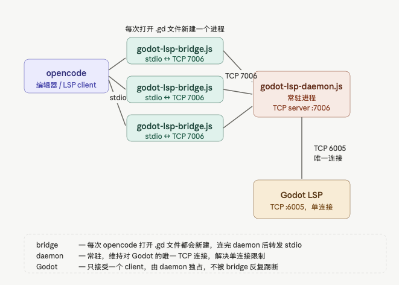
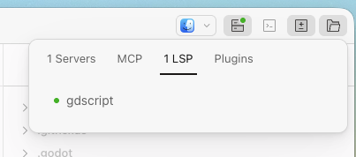

# Godot-lsp-opencode




## opencode
```json
{
  "$schema": "https://opencode.ai/config.json",
  "lsp": {
    "gdscript": {
        "command": ["node", "/xxx_path/godot-lsp-bridge.js"],
        "extensions": [".gd", ".gdshader"],
    }
  },
  "mcp": ...
```

## run daemon
```bash
node godot-lsp-daemon.js --godot /Applications/Godot.app/Contents/MacOS/Godot --project ~/Dev/Proj-A
[2026-05-25T04:09:19.069Z] === godot-lsp-daemon starting (daemon port: 7006) ===
[2026-05-25T04:09:19.073Z] Godot LSP already running on 6005
[2026-05-25T04:09:19.074Z] Connected to Godot LSP 127.0.0.1:6005
[2026-05-25T04:09:19.183Z] Daemon listening on 127.0.0.1:7006
[2026-05-25T04:11:53.423Z] Bridge client connected: 127.0.0.1:53956
[2026-05-25T04:11:53.503Z] rewrite: plaintext → gdscript
...
```